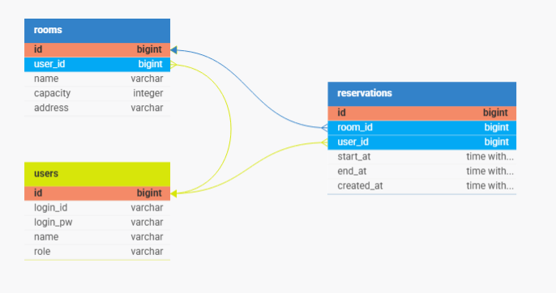

# 🗺️ 싱크라이프 백엔드 신입 개발자 과제 — 스터디룸 예약

## 프로젝트 개요
스터디룸 예약 시스템 백엔드 프로젝트로, Spring Boot와 PostgreSQL을 사용하여 동시성 환경에서도 예약 무결성을 보장합니다.
사용자는 방 조회 및 예약, 취소를 수행할 수 있으며, 관리자(Admin)는 방 등록과 관리 권한을 가집니다.
PostgreSQL의 tstzrange와 EXCLUDE 제약을 활용하여 동일 시간대 중복 예약을 방지하고, 간단한 토큰 기반 인증으로 접근 제어를 구현합니다.


## 🔨 개발 환경
- **IDE**: IntelliJ IDEA
- **언어**: Java 21
- **프레임워크**: Spring Boot
- **빌드 도구**: Gradle (Kotlin DSL)
- **DB**: PostgreSQL 17

## 📦 Dependency
- **Spring Boot**
  - spring-boot-starter-data-jpa
  - spring-boot-starter-web
  - spring-boot-starter-validation
  - spring-boot-devtools
- **Database**
  - postgresql
- **QueryDSL**
  - querydsl-jpa
  - querydsl-apt
- **Lombok**

## 🏗️ 프로젝트 구조
<details>
  <summary>프로젝트 구조</summary>
  
```bash
src
├─ main
│  ├─ java
│  │  └─ com.synclife.studyroom
│  │      ├─ StudyroomApplication.java
│  │      ├─ TestDataInitializer.java
│  │      │
│  │      ├─ application
│  │      │  ├─ controller
│  │      │  │   ├─ ReservationController.java
│  │      │  │   ├─ RoomController.java
│  │      │  │   └─ UserController.java
│  │      │  │
│  │      │  ├─ dto
│  │      │  │   ├─ request
│  │      │  │   │   ├─ LoginRequest.java
│  │      │  │   │   ├─ ReservationRequest.java
│  │      │  │   │   └─ RoomRequest.java
│  │      │  │   │
│  │      │  │   └─ response
│  │      │  │       ├─ ReservationResponse.java
│  │      │  │       ├─ RoomReservationResponse.java
│  │      │  │       ├─ RoomResponse.java
│  │      │  │       └─ StartEndTime.java
│  │      │  │
│  │      │  └─ service
│  │      │      ├─ ReservationWriteService.java
│  │      │      ├─ RoomReadService.java
│  │      │      ├─ RoomWriteService.java
│  │      │      └─ UserReadService.java
│  │      │
│  │      ├─ domain
│  │      │  ├─ entity
│  │      │  │   ├─ Reservation.java
│  │      │  │   ├─ Room.java
│  │      │  │   ├─ User.java
│  │      │  │   └─ constant
│  │      │  │       └─ Role.java
│  │      │  │
│  │      │  └─ repository
│  │      │      ├─ ReservationRepository.java
│  │      │      ├─ RoomRepository.java
│  │      │      ├─ UserRepository.java
│  │      │      └─ custom
│  │      │          ├─ RoomRepositoryCustom.java
│  │      │          └─ RoomRepositoryCustomImpl.java
│  │      │
│  │      └─ global
│  │          ├─ config
│  │          │   └─ QueryDSLConfig.java
│  │          │
│  │          ├─ exception
│  │          │   ├─ CustomException.java
│  │          │   ├─ GlobalExceptionHandler.java
│  │          │   ├─ dto
│  │          │   │   └─ ErrorResponse.java
│  │          │   └─ errorcode
│  │          │       ├─ ErrorCode.java
│  │          │       ├─ ReservationErrorCode.java
│  │          │       ├─ RoomErrorCode.java
│  │          │       └─ UserErrorCode.java
│  │          │
│  │          └─ security
│  │              ├─ TokenService.java
│  │              └─ UserPayload.java
│  │
│  └─ resources
│      ├─ application.yaml
│      ├─ ddl.sql
│      ├─ db
│      ├─ static
│      └─ templates
│
└─ test
    └─ java
        └─ com.synclife.studyroom
            └─ StudyroomApplicationTests.java

 ```
</details>


## 💽ERD
<center>

</center>
<details>
  <summary> DDL </summary>

```sql
CREATE EXTENSION IF NOT EXISTS btree_gist;

CREATE TABLE IF NOT EXISTS "users"
(
  "id"       bigserial    NOT NULL UNIQUE,
  "login_id" varchar(255) NOT NULL,
  "login_pw" varchar(255) NOT NULL,
  "name"     varchar(255) NOT NULL,
  "role"     varchar(255) NOT NULL DEFAULT '8',
  PRIMARY KEY ("id")
);

CREATE TABLE IF NOT EXISTS "rooms"
(
  "id"       bigserial    NOT NULL UNIQUE,
  "user_id"  bigint       NOT NULL,
  "name"     varchar(255) NOT NULL,
  "capacity" int          NOT NULL,
  "address"  varchar(255) NOT NULL,
  PRIMARY KEY ("id")
);

CREATE TABLE IF NOT EXISTS "reservations"
(
  "id"         bigserial   NOT NULL UNIQUE,
  "room_id"    bigint      NOT NULL,
  "user_id"    bigint      NOT NULL,
  "start_at"   TIMESTAMPTZ NOT NULL,
  "end_at"     TIMESTAMPTZ NOT NULL,
  "created_at" TIMESTAMPTZ NOT NULL,

  EXCLUDE USING gist(
    room_id WITH =,
    tstzrange(start_at, end_at, '[)') WITH &&
    ),
  PRIMARY KEY ("id")
);

-- rooms FK
ALTER TABLE "rooms"
  DROP CONSTRAINT IF EXISTS "rooms_fk1";
ALTER TABLE "rooms"
  ADD CONSTRAINT "rooms_fk1" FOREIGN KEY ("user_id") REFERENCES "users" ("id");

-- reservations FK
ALTER TABLE "reservations"
  DROP CONSTRAINT IF EXISTS "reservations_fk1";
ALTER TABLE "reservations"
  ADD CONSTRAINT "reservations_fk1" FOREIGN KEY ("room_id") REFERENCES "rooms" ("id");

ALTER TABLE "reservations"
  DROP CONSTRAINT IF EXISTS "reservations_fk2";
ALTER TABLE "reservations"
  ADD CONSTRAINT "reservations_fk2" FOREIGN KEY ("user_id") REFERENCES "users" ("id");

SET TIME ZONE 'Asia/Seoul';

 ```
</details>

## ✏️ 테이블 명세서
[테이블 명세서](doc/tableSpec-doc.md)

## ▶️ 실행가이드
[실행가이드](./doc/runningGuide-doc.md)

## 📚 API 문서
[API 문서](doc/api-doc.md)

## 🛠️ ADR
[ADR](doc/api-doc.md)

## ⚛️ LLM
[LLM](doc/llm-doc.md)